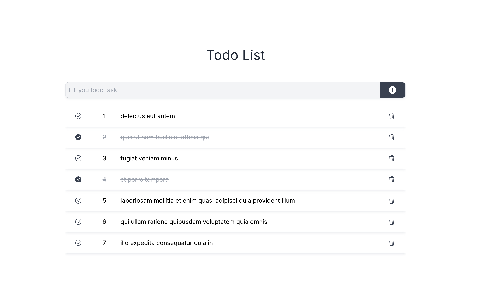

# Next Test TodoList

A simple Todo-list APP by Next.js, Redux Toolkit + TypeScript.

Main dependencies:
  - Next.js 14
  - TypeScript
  - Redux Toolkit
  - Twin + styled-components


# Demo



[Demo Link](https://next-test-todolist.vercel.app/)

Deploy by [Vercel Platform](https://vercel.com/new?utm_medium=default-template&filter=next.js&utm_source=create-next-app&utm_campaign=create-next-app-readme)


## Local Installation

```bash
npm run dev
# or
yarn dev
# or
pnpm dev
# or
bun dev
```

Open [http://localhost:3000](http://localhost:3000) with your browser to see the result.


## Functions

- Read: The list auto loaded in first
- Create: Add todo by input text
- Update: Click the 'check' icon, switch the todo' s completed status
- Delete: Click the 'trash' icon, delete the todo you chose
